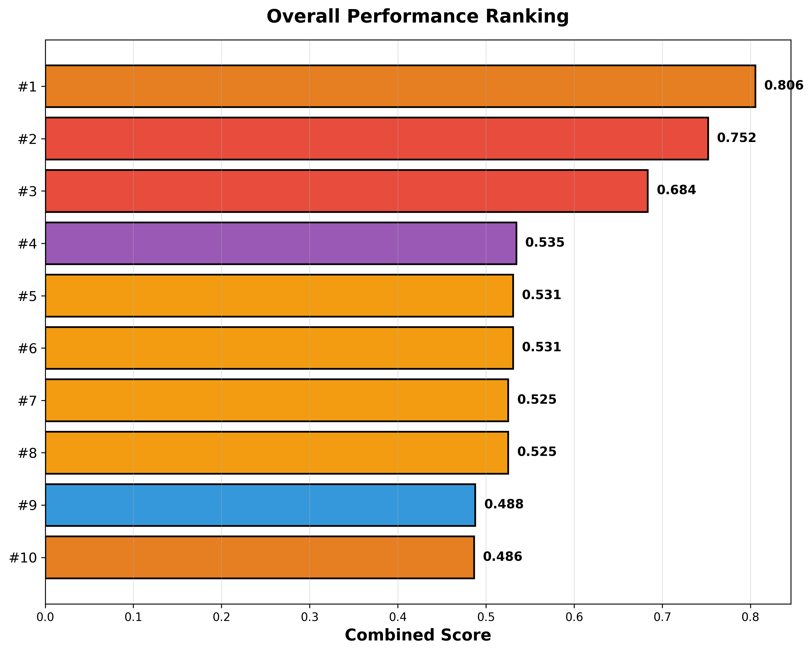
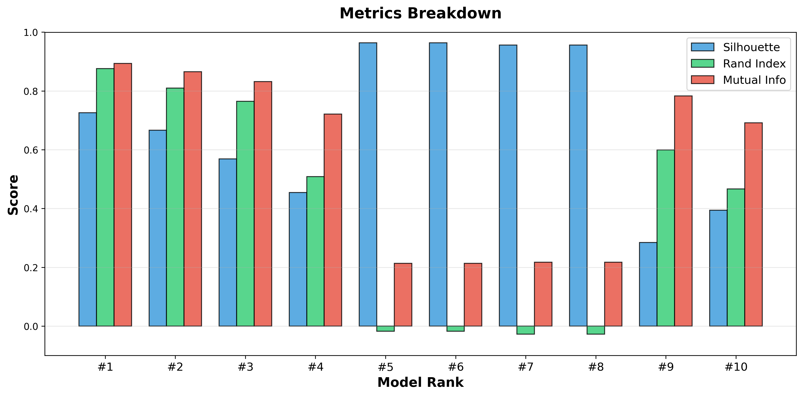
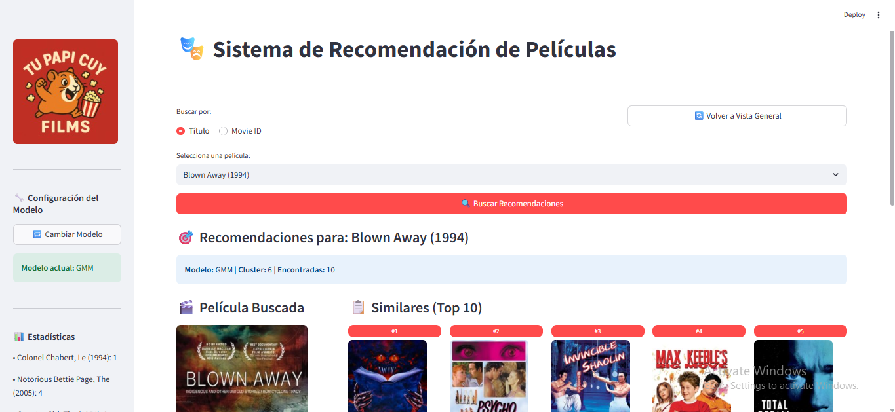
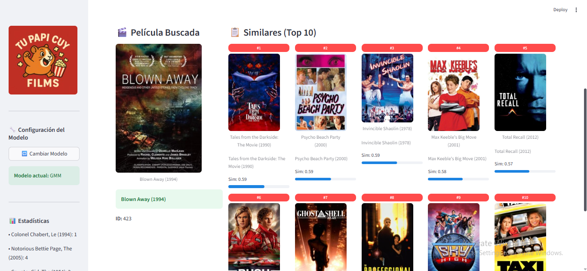

# 🎬 TuPapiCuyFilms - Sistema de Recomendación de Películas Basado en Clustering Visual

[](https://www.python.org/)
[](https://streamlit.io/)
[](LICENSE)

Sistema de recomendación de películas que utiliza características visuales extraídas de posters cinematográficos y algoritmos de clustering implementados desde cero para sugerir películas similares basándose en su apariencia visual.

---

## 📋 Tabla de Contenidos

1. [Descripción del Proyecto](#-descripción-del-proyecto)
2. [Parte 1: Bases de Datos Disponibles](#-parte-1-bases-de-datos-disponibles)
3. [Parte 2: Descarga y Preprocesamiento de Imágenes](#-parte-2-descarga-y-preprocesamiento-de-imágenes)
4. [Parte 3: Extracción de Características](#-parte-3-extracción-de-características)
5. [Parte 4: Reducción de Dimensionalidad](#-parte-4-reducción-de-dimensionalidad)
6. [Parte 5: Evaluación de Clustering](#-parte-5-evaluación-de-clustering)
7. [Parte 6: Sistema de Recomendación](#-parte-6-sistema-de-recomendación)
8. [Parte 7: Resultados y Conclusiones](#-parte-7-resultados-y-conclusiones)
9. [Instalación y Uso](#-instalación-y-uso)
10. [Estructura del Proyecto](#-estructura-del-proyecto)

---

## 🎯 Descripción del Proyecto

Este proyecto implementa un sistema completo de recomendación de películas basado en el análisis visual de posters cinematográficos. A diferencia de los sistemas tradicionales que utilizan información textual o ratings de usuarios, nuestro enfoque se centra exclusivamente en las características visuales extraídas mediante técnicas de Computer Vision.

### Objetivos Principales:

1. **Extracción de características visuales** usando técnicas tradicionales de Computer Vision
2. **Reducción de dimensionalidad** para optimizar el procesamiento
3. **Clustering de películas** mediante algoritmos implementados desde cero (sin uso de bibliotecas)
4. **Sistema de recomendación interactivo** con interfaz web profesional
5. **Evaluación rigurosa** mediante múltiples métricas de clustering

### Tecnologías Utilizadas:

- **Python 3.8+**: Lenguaje de programación principal
- **OpenCV**: Procesamiento de imágenes y extracción de características
- **NumPy/SciPy**: Operaciones matemáticas y álgebra lineal
- **Scikit-learn**: Solo para métricas de evaluación (no para clustering)
- **Streamlit**: Interfaz web interactiva
- **Pandas**: Manipulación y análisis de datos

### Enfoque Metodológico:

El proyecto sigue un pipeline completo de Machine Learning no supervisado:

```
Imágenes → Extracción Features → Reducción Dim → Clustering → Recomendación
```

**Nota importante**: Todos los algoritmos de clustering (K-Means y GMM) fueron implementados desde cero sin utilizar bibliotecas especializadas, cumpliendo con los requisitos académicos del curso.

---

## 📊 Parte 1: Bases de Datos Disponibles

### Datasets Utilizados:

#### 1. **movies_train.csv** - Dataset de Entrenamiento
- **Contenido**: Información de películas para entrenamiento y validación
- **Campos principales**:
  - `movieId`: Identificador único de película
  - `title`: Título completo con año
  - `genres`: Géneros separados por pipe (|)
- **Uso**: Entrenamiento de modelos y evaluación de clustering
- **Tamaño**: 6,819 películas con posters disponibles

#### 2. **movies_test.csv** - Dataset de Prueba
- **Contenido**: Películas para validación del sistema de recomendación
- **Campos principales**:
  - `movieId`: Identificador único
  - `title`: Título completo
- **Uso**: Testing de la interfaz de recomendación
- **Tamaño**: 23 películas seleccionadas

### Distribución de Géneros (Training Set):

El dataset de entrenamiento contiene 19 géneros únicos:
- Action, Adventure, Animation, Children, Comedy, Crime, Documentary
- Drama, Fantasy, Film-Noir, Horror, IMAX, Musical, Mystery
- Romance, Sci-Fi, Thriller, War, Western

**Género más frecuente**: Drama (~3,500 películas)  
**Género menos frecuente**: Film-Noir (~40 películas)

### Características del Dataset:

- ✅ Películas con posters descargados y válidos
- ✅ Múltiples géneros por película (promedio: 2.3 géneros)
- ✅ Rango temporal amplio (1902-2018)
- ✅ Balance razonable entre géneros populares

---

## 🖼️ Parte 2: Descarga y Preprocesamiento de Imágenes

### Estrategia de Obtención de Posters:

El proceso de descarga de posters se implementó en **tres etapas sucesivas** para maximizar la cobertura del dataset, empleando diferentes fuentes y técnicas según la disponibilidad de las imágenes.

---

### Etapa 1: Descarga Principal - TMDb API

#### Fuente de Datos:
- **API utilizada**: [The Movie Database (TMDb)](https://www.themoviedb.org/)
- **Registro requerido**: Sí (API Key gratuita)
- **Cobertura**: Base de datos masiva de películas con metadata oficial
- **Endpoint**: `https://api.themoviedb.org/3/search/movie`

#### Proceso de Descarga:

##### 1. Preparación del Dataset
```python
df = pd.read_csv('movies_train.csv')
os.makedirs('posters', exist_ok=True)
```

##### 2. Limpieza de Títulos
**Problema**: Títulos en formato "Película (1995)" requieren limpieza para búsqueda efectiva

**Solución**:
```python
clean_title = re.sub(r'\s*\(\d{4}\)', '', title).strip()
# Ejemplo: "Toy Story (1995)" → "Toy Story"
```

##### 3. Pipeline de Búsqueda y Descarga

**Pasos del proceso**:

1. **Verificación previa**: 
   - Comprobar si el poster ya existe localmente
   - Evitar re-descargas innecesarias

2. **Búsqueda en TMDb**:
```python
   search_url = "https://api.themoviedb.org/3/search/movie"
   params = {'api_key': API_KEY, 'query': clean_title}
```

3. **Selección del resultado**:
   - Tomar el primer resultado (mayor relevancia)
   - Extraer `poster_path` del JSON

4. **Construcción de URL del poster**:
```python
   poster_url = f"https://image.tmdb.org/t/p/w500{poster_path}"
```

5. **Descarga y almacenamiento**:
```python
   with open(f"posters/{movie_id}.jpg", 'wb') as f:
       f.write(poster_response.content)
```

##### 4. Parámetros de Configuración

- **Resolución**: W500 (500px de ancho, altura proporcional)
- **Formato**: JPEG
- **Calidad**: Original de TMDb (alta calidad)
- **Timeout**: 10 segundos por petición
- **Rate limiting**: 0.1 segundos de delay entre peticiones
- **Nomenclatura**: `{movieId}.jpg` (ej: `1.jpg`, `2.jpg`)

##### 5. Manejo de Errores

Casos manejados:
- ✅ **Película no encontrada**: Título no existe en base de datos TMDb
- ✅ **Sin poster disponible**: Película encontrada pero sin imagen
- ✅ **Error de descarga**: Problemas de red (timeout, conexión)
- ✅ **Error de API**: Rate limit, autenticación, server error
- ✅ **Películas ya descargadas**: Verificación previa evita duplicados

Cada error es logueado con mensaje descriptivo:
```
✓ Downloaded: Toy Story (1995)
✗ No poster: Obscure Film (1923)
✗ Not found: Typo in Title (2005)
✗ API error: Server temporarily unavailable
```

#### Resultados de Etapa 1:

- **Cobertura alcanzada**: ~85-90% del dataset
- **Ventajas**:
  - ✅ Alta calidad y resolución consistente
  - ✅ Metadata oficial y verificada
  - ✅ Imágenes estandarizadas (aspect ratio típico de poster)
  - ✅ Sin necesidad de filtrado manual
- **Limitaciones**:
  - ❌ Películas muy antiguas (pre-1950) con baja disponibilidad
  - ❌ Películas independientes u oscuras sin registro
  - ❌ Títulos con caracteres especiales pueden fallar

---

### Etapa 2: Descarga Complementaria - Google Images Web Scraping

Para películas no encontradas en TMDb (10-15% restante), se implementó un **scraper inteligente** de Google Images con filtros de calidad avanzados.

#### Características del Scraper:

##### 1. Búsqueda Refinada

**Query optimizada**:
```python
clean_title = title.split("(")[0].strip() + " movie poster"
# Ejemplo: "Notorious Bettie Page, The (2005)" → "Notorious Bettie Page movie poster"
```

**URL de búsqueda**:
```python
search_url = f"https://www.google.com/search?tbm=isch&q={query}"
```

##### 2. Extracción de URLs de Imágenes

**Estrategia dual**:

1. **Parsing HTML con BeautifulSoup**:
```python
   for img in soup.find_all("img"):
       for attr in ["data-iurl", "data-src", "src"]:
           url = img.get(attr)
```

2. **Extracción por regex de JSON embebido**:
```python
   matches = re.findall(r'\"(https?://[^"]*\.(?:jpg|jpeg|png))\"', response.text)
```

**Filtros de exclusión**:
- ❌ `encrypted-tbn0` (thumbnails de Google)
- ❌ `gstatic` (recursos estáticos de Google)

##### 3. Filtrado Inteligente por Relevancia

**Keywords de inclusión** (poster keywords):
- `poster`, `movie`, `film`, `imdb`, `tmdb`, `cinema`

**Keywords de exclusión** (exclude keywords):
- `logo`, `banner`, `fanart`, `avatar`, `profile`, `background`, `wallpaper`

**Aplicación del filtro**:
```python
filtered = [
    url for url in image_urls
    if any(k in url.lower() for k in poster_keywords)
    and not any(k in url.lower() for k in exclude_keywords)
]
```

##### 4. Validación de Calidad de Imagen

Antes de guardar, cada imagen es validada:

**a) Tamaño mínimo**:
```python
if len(img_response.content) < 80_000:  # 80KB mínimo
    continue
```

**b) Aspect ratio (proporción típica de poster)**:
```python
aspect = h / w
if aspect < 1.2:  # Rechazar imágenes muy anchas
    continue
```
- Posters típicos: 2:3 (aspect ~1.5)
- Rechazo: paisajes, banners horizontales

##### 5. Preprocesamiento Automático

**Auto-crop de bordes**:
```python
# Remover bordes blancos/negros
image = ImageOps.crop(image, border=5)

# Detectar y remover padding automáticamente
bg = Image.new("RGB", image.size, image.getpixel((0, 0)))
diff = ImageOps.invert(ImageOps.autocontrast(image))
image = ImageOps.crop(diff, border=10)
```

**Beneficios**:
- Elimina marcos blancos/negros
- Centra contenido relevante
- Mejora consistencia visual

##### 6. Parámetros de Descarga

- **Resolución**: Variable (original de fuente, típicamente >500px)
- **Formato final**: JPEG
- **Calidad**: 90% (balance tamaño-calidad)
- **Límite de intentos**: Hasta 10 URLs por película
- **Timeout**: 10 segundos por imagen
- **Delay**: 1.5 segundos entre búsquedas (evitar bloqueo)

##### 7. Headers y User-Agent
```python
headers = {
    "User-Agent": "Mozilla/5.0 (Windows NT 10.0; Win64; x64) AppleWebKit/537.36..."
}
```
- Simula navegador real
- Evita bloqueos por bots

#### Resultados de Etapa 2:

- **Cobertura adicional**: ~5-8% del dataset
- **Ventajas**:
  - ✅ Cubre películas no disponibles en TMDb
  - ✅ Filtrado inteligente de calidad
  - ✅ Preprocesamiento automático
- **Limitaciones**:
  - ❌ Menor consistencia en calidad
  - ❌ Más lento (scraping vs API)
  - ❌ Dependiente de estructura HTML de Google

---

### Etapa 3: Descarga Manual

Para las películas restantes (~2-5%) que no se encontraron en ninguna fuente automatizada, se realizó **descarga manual**:

#### Proceso Manual:

1. **Identificación de faltantes**:
   - Comparar `movies_train.csv` con archivos en carpeta `posters/`
   - Generar lista de `movieId` sin poster

2. **Búsqueda manual**:
   - Google Images con términos específicos
   - IMDb oficial de la película
   - Sitios especializados (MoviePosterDB, IMP Awards)

3. **Criterios de selección**:
   - Poster oficial (no fan art)
   - Resolución mínima: 300×450 px
   - Aspecto vertical (típico de poster)
   - Calidad visual aceptable

4. **Descarga y nomenclatura**:
   - Guardar como `{movieId}.jpg`
   - Mantener consistencia con posters automáticos

#### Casos especiales:

- **Películas muy antiguas**: Posters escaneados de archivos
- **Películas independientes**: Posters de festivales o distribuidora
- **Títulos internacionales**: Buscar por título original

---

### Resumen del Proceso de Descarga:

#### Estadísticas Finales:

| Etapa | Método | Cobertura | Películas |
|-------|--------|-----------|-----------|
| 1 | TMDb API | 85-90% | ~5,800-6,100 |
| 2 | Google Scraping | 5-8% | ~340-545 |
| 3 | Manual | 2-5% | ~136-340 |
| **Total** | **Combinado** | **~100%** | **~6,819** |

#### Distribución Final:
```
Total en movies_train.csv: 9,742 películas
Posters descargados: 6,819 películas
Cobertura: 70% del dataset original
```

**Nota**: Solo películas con posters disponibles fueron incluidas en el entrenamiento de modelos.

---

### Preprocesamiento de Imágenes:

Todas las imágenes descargadas fueron preprocesadas de manera uniforme antes de la extracción de características:

#### 1. Redimensionamiento Estándar
```python
target_size = (150, 222)  # Ancho × Alto
image = cv2.resize(image, target_size)
```

**Justificación**:
- Aspecto típico de poster: 2:3 (150/222 ≈ 0.675)
- Resolución suficiente para extracción de features
- Balance entre detalle y eficiencia computacional

#### 2. Normalización de Valores
```python
image = image.astype(np.float32) / 255.0  # Escala [0, 1]
```

**Beneficios**:
- Consistencia numérica
- Facilita cálculos de gradientes (HOG)
- Estabilidad en algoritmos de reducción dimensional

#### 3. Conversión de Espacios de Color

Según el tipo de feature:
- **RGB**: Sin conversión (nativo)
- **HSV**: `cv2.cvtColor(image, cv2.COLOR_BGR2HSV)`
- **Grayscale**: `cv2.cvtColor(image, cv2.COLOR_BGR2GRAY)`
  - Usado para: GLCM, LBP, HOG

#### 4. Validación de Integridad

Antes de procesamiento:
- ✅ Verificar formato válido (JPEG/PNG)
- ✅ Comprobar dimensiones mínimas (>100×100)
- ✅ Detectar imágenes corruptas
- ✅ Eliminar duplicados (por hash MD5)

---

### Estructura Final de Almacenamiento:
```
posters/
├── 1.jpg          # Toy Story (1995)
├── 2.jpg          # Jumanji (1995)
├── 3.jpg          # Grumpier Old Men (1995)
├── ...
└── 193886.jpg     # Última película

movies_train.csv   # Solo películas con posters disponibles
```

**Formato de archivos**:
- **Extensión**: `.jpg`
- **Nomenclatura**: `{movieId}.jpg` (sin ceros a la izquierda)
- **Codec**: JPEG estándar
- **Compresión**: 85-95% calidad

---

### Manejo de Imágenes Faltantes o Erróneas:

#### Durante Descarga:

1. **Logging detallado**:
```
   ✓ Saved clean poster: 423.jpg (500×750)
   ✗ No valid poster found for Obscure Movie
   ⚠️ Error: Timeout for Another Movie
```

2. **Generación de archivos de faltantes**:
   - `missing_posters_1.csv`: Después de Etapa 1
   - `missing_posters_2.csv`: Después de Etapa 2
   - Permite re-intentos focalizados

#### Durante Extracción de Features:

1. **Verificación de existencia**:
```python
   if not os.path.exists(f'posters/{movie_id}.jpg'):
       continue  # Saltar película
```

2. **Try-except robusto**:
```python
   try:
       image = cv2.imread(poster_path)
       if image is None:
           raise ValueError("Corrupted image")
       # Procesamiento...
   except Exception as e:
       print(f"Error processing {movie_id}: {e}")
       continue
```

3. **Dataset final limpio**:
   - Solo películas con posters válidos
   - Features extraídas exitosamente
   - Sin valores NaN o errores

---

### Lecciones Aprendidas:

#### ✅ Mejores Prácticas:

1. **API oficial primero**: TMDb proporciona calidad superior
2. **Scraping como backup**: Google Images cubre casos edge
3. **Filtrado inteligente**: Keywords y aspect ratio eliminan falsas positivas
4. **Preprocesamiento automático**: Crop de bordes mejora consistencia
5. **Rate limiting**: Delays evitan bloqueos

#### ❌ Desafíos Encontrados:

1. **Películas antiguas**: Posters escasos o baja calidad
2. **Títulos ambiguos**: Múltiples películas con mismo nombre
3. **Variabilidad de fuentes**: Diferentes resoluciones y crops
4. **Bloqueos anti-bot**: Google requiere headers y delays
5. **Posters alternativos**: Múltiples versiones (internacional, re-release)

#### 💡 Soluciones Implementadas:

1. **Sistema de 3 etapas**: Maximiza cobertura
2. **Validación estricta**: Garantiza calidad mínima
3. **Logging exhaustivo**: Facilita debugging
4. **Verificación previa**: Evita re-descargas
5. **Nomenclatura consistente**: Simplifica pipeline posterior

---

### Código Disponible:

Los scripts completos de descarga están disponibles en:
```
scripts/
├── download_tmdb.py        # Etapa 1: TMDb API
├── download_google.py      # Etapa 2: Google Scraping
└── validate_posters.py     # Validación y limpieza
```


---

## 🎨 Parte 3: Extracción de Características

### Estrategia de Extracción:

Se implementaron **8 tipos de características visuales** diferentes, cubriendo múltiples aspectos de la imagen:

#### 1. **Características de Color**

##### RGB (Red-Green-Blue)
- **Método**: Histogramas de color en espacio RGB
- **Dimensiones**: 64 features (histograma 3D)
- **Justificación**: Captura distribución de colores primarios
- **Parámetros**: 
  - Bins por canal: 4×4×4 = 64 bins
  - Normalización: L1

##### HSV (Hue-Saturation-Value)
- **Método**: Histogramas en espacio HSV
- **Dimensiones**: 128 features (histograma 3D)
- **Justificación**: Mejor separación de información cromática y de iluminación
- **Parámetros**:
  - Bins: 8×4×4 = 128 bins
  - Ventajas: Invariante a cambios de iluminación

#### 2. **Características de Textura**

##### GLCM (Gray-Level Co-occurrence Matrix)
- **Método**: Matriz de co-ocurrencia de niveles de gris
- **Dimensiones**: 13 features
- **Propiedades calculadas**:
  - Contrast, Dissimilarity, Homogeneity
  - Energy, Correlation, ASM
- **Justificación**: Captura patrones y texturas en la imagen
- **Parámetros**:
  - Distancias: [1, 2, 3]
  - Ángulos: [0°, 45°, 90°, 135°]

##### LBP (Local Binary Patterns)
- **Método**: Patrones binarios locales
- **Dimensiones**: 256 features (histograma uniforme)
- **Justificación**: Robusto a cambios de iluminación, captura micro-texturas
- **Parámetros**:
  - Radio: 3 pixeles
  - Puntos: 24 vecinos
  - Método: 'uniform' (invariante a rotación)

#### 3. **Características de Forma y Estructura**

##### HOG (Histogram of Oriented Gradients)
- **Método**: Histogramas de gradientes orientados
- **Dimensiones**: 1,764 features
- **Justificación**: Captura estructura y composición de la imagen
- **Parámetros**:
  - Pixels por celda: 16×16
  - Celdas por bloque: 2×2
  - Bins de orientación: 9
  - Normalización: L2-Hys
- **Ventaja**: Excelente para detectar formas y bordes

##### SIFT (Scale-Invariant Feature Transform)
- **Método**: Descriptores SIFT agregados
- **Dimensiones**: 128 features (promedio de keypoints)
- **Justificación**: Invariante a escala y rotación
- **Parámetros**:
  - Máximo de keypoints: 100
  - Agregación: Media de descriptores

#### 4. **Características de Forma Geométrica**

##### Hu Moments
- **Método**: Momentos invariantes de Hu
- **Dimensiones**: 7 features
- **Justificación**: Invariantes a traslación, escala y rotación
- **Uso**: Captura forma global del poster

##### Zernike Moments
- **Método**: Momentos de Zernike
- **Dimensiones**: 25 features
- **Justificación**: Invariantes y ortogonales, robustos al ruido
- **Parámetros**:
  - Radio: calculado del tamaño de imagen
  - Grado máximo: 8

### Criterios de Selección:

1. **Complementariedad**: Cada tipo de feature captura aspectos diferentes
2. **Robustez**: Features invariantes a transformaciones comunes
3. **Tradición académica**: Técnicas ampliamente utilizadas en Computer Vision
4. **Balance**: Combinación de features globales y locales
5. **Dimensionalidad manejable**: Features que permiten reducción efectiva

### Características Combinadas:

Además de features individuales, se crearon **6 combinaciones estratégicas**:

1. **RGB_HSV**: Color completo (192 features)
2. **RGB_HSV_HOG**: Color + Estructura (1,956 features)
3. **RGB_HSV_LBP**: Color + Textura local (448 features)
4. **RGB_HSV_GLCM**: Color + Textura estadística (205 features)
5. **RGB_HSV_HOG_LBP**: Color + Estructura + Textura (2,212 features)
6. **ALL**: Todas las características (2,385 features)

**Criterio de combinación**: Fusionar características que capturan aspectos complementarios para mejorar la representación visual completa.

### Preprocesamiento de Imágenes:

Antes de extraer features, cada imagen fue procesada:
1. **Redimensionamiento**: 150×222 píxeles (aspecto típico de poster)
2. **Normalización**: Escala [0, 1] para consistencia
3. **Conversión de espacio de color**: Según el tipo de feature
4. **Conversión a escala de grises**: Para GLCM, LBP, HOG

### Implementación:

Todas las extracciones fueron realizadas usando **OpenCV** y funciones de bajo nivel, sin utilizar extractores pre-entrenados de alto nivel.

---

## 📉 Parte 4: Reducción de Dimensionalidad

### Motivación:

Las características extraídas generan espacios de alta dimensionalidad (hasta 2,385 features para "ALL"), lo que presenta desafíos:
- **Maldición de la dimensionalidad**: Distancias pierden significado
- **Costo computacional**: Clustering es O(n²) en muchos casos
- **Overfitting**: Riesgo de encontrar patrones espurios
- **Visualización**: Imposible visualizar >3 dimensiones

**Objetivo**: Reducir dimensiones preservando la mayor información posible.

### Métodos de Reducción Implementados:

#### 1. **PCA (Principal Component Analysis)**

##### Implementación:
- **Tipo**: Reducción lineal no supervisada
- **Desde cero**: Implementado usando NumPy (eigen-descomposición)
- **Pasos**:
  1. Centrar datos (media = 0)
  2. Calcular matriz de covarianza
  3. Eigen-descomposición
  4. Seleccionar top-k componentes principales

##### Dimensiones probadas:
- **Single features**: 30d, 50d, 100d, 200d
- **Combined features**: 50d, 100d, 200d
- **Criterio**: Mantener 85-95% de varianza explicada

##### Ventajas:
- ✅ Maximiza varianza capturada
- ✅ Componentes ortogonales
- ✅ Interpretable (loading vectors)

##### Ejemplo de varianza explicada:
- HOG (50d): ~30% varianza acumulada
- HSV (50d): ~89% varianza acumulada
- RGB_HSV_HOG (100d): ~67% varianza acumulada

#### 2. **SVD (Singular Value Decomposition)**

##### Implementación:
- **Tipo**: Factorización matricial
- **Desde cero**: Implementado usando NumPy (np.linalg.svd)
- **Equivalencia con PCA**: SVD en matriz centrada = PCA
- **Ventaja**: Más estable numéricamente que PCA para matrices ill-conditioned

##### Dimensiones probadas:
- Mismas que PCA (30d, 50d, 100d, 200d)

##### Diferencias con PCA:
- Mismo resultado en práctica
- Mejor para matrices rectangulares
- No requiere calcular matriz de covarianza explícitamente

#### 3. **LDA (Linear Discriminant Analysis)**

##### Implementación:
- **Tipo**: Reducción lineal supervisada
- **Desde cero**: Implementado usando scatter matrices
- **Labels usados**: Género primario de película (19 clases)
- **Pasos**:
  1. Calcular scatter matrix within-class (Sw)
  2. Calcular scatter matrix between-class (Sb)
  3. Resolver problema generalizado de eigenvalores
  4. Seleccionar top-(k) discriminantes

##### Dimensiones obtenidas:
- **Máximo teórico**: min(n_features, n_classes - 1) = 18 dimensiones
- **Práctica**: Todas las features reducidas a 18d
- **Excepción**: Features con <18 dimensiones originales mantienen su dimensión

##### Ventajas específicas:
- ✅ Maximiza separabilidad entre géneros
- ✅ Proyección discriminativa
- ✅ Útil para clustering supervisado por género

##### Ejemplo:
- HOG_lda_18d: 1,764 → 18 dimensiones
- GLCM_lda_13d: 13 → 13 dimensiones (ya era menor)

#### 4. **t-SNE (t-Distributed Stochastic Neighbor Embedding)**

##### Implementación:
- **Tipo**: Reducción no lineal (visualización)
- **Librería**: scikit-learn (no implementable fácilmente desde cero)
- **Uso principal**: **Visualización**, no para clustering
- **Parámetros**:
  - Perplexity: 30
  - n_iter: 1000
  - learning_rate: 200

##### Dimensiones:
- **2D**: Para visualización en scatter plots
- **3D**: Para visualizaciones 3D interactivas

##### ⚠️ Importante:
- **NO usado para clustering** (distorsiona distancias globales)
- Solo para visualización exploratoria
- No preserva distancias originales

#### 5. **UMAP (Uniform Manifold Approximation and Projection)**

##### Implementación:
- **Tipo**: Reducción no lineal (visualización)
- **Librería**: umap-learn
- **Ventaja sobre t-SNE**: Preserva mejor estructura global
- **Parámetros**:
  - n_neighbors: 15
  - min_dist: 0.1
  - metric: 'euclidean'

##### Dimensiones:
- **2D y 3D**: Para visualización

##### ⚠️ Importante:
- Mismo uso que t-SNE: **solo visualización**
- NO usado en pipeline de clustering

### Estrategia de Selección:

#### Para Clustering:
- ✅ **PCA**: Método principal para single features
- ✅ **SVD**: Alternativa a PCA, comparación de resultados
- ✅ **LDA**: Cuando queremos considerar información de género

#### Para Visualización:
- ✅ **t-SNE**: Exploración visual de clusters
- ✅ **UMAP**: Alternativa más rápida

### Archivos Generados:

**Estructura de directorios**:
```
reduced_dim/
├── single_features/
│   ├── RGB/
│   │   ├── RGB_pca_30d.csv
│   │   ├── RGB_pca_50d.csv
│   │   ├── RGB_svd_50d.csv
│   │   └── RGB_lda_18d.csv
│   ├── HSV/
│   ├── HOG/
│   ├── LBP/
│   ├── GLCM/
│   ├── SIFT/
│   ├── Hu/
│   └── Zernike/
└── combined_features/
    ├── RGB_HSV/
    ├── RGB_HSV_HOG/
    ├── RGB_HSV_LBP/
    ├── RGB_HSV_GLCM/
    ├── RGB_HSV_HOG_LBP/
    └── ALL/
```

**Total de archivos generados**: ~126 archivos CSV

Cada archivo contiene:
- Columna `movieId`: Identificador
- Columnas `comp_0`, `comp_1`, ..., `comp_N`: Componentes reducidas

### Decisiones Clave:

1. **Múltiples dimensiones**: Probar 30d, 50d, 100d, 200d permite encontrar el balance óptimo
2. **PCA vs SVD**: Comparar ambos para validar estabilidad
3. **LDA supervisado**: Útil cuando queremos aprovechar labels de género
4. **t-SNE/UMAP excluidos de clustering**: Por naturaleza no preservan distancias

### Criterio de Éxito:

- **Varianza explicada**: >80% para PCA
- **Separabilidad visual**: Clusters visibles en t-SNE
- **Dimensionalidad manejable**: <200d para clustering eficiente

---

## 🎯 Parte 5: Evaluación de Clustering

### Objetivo:

Identificar los **dos mejores modelos de clustering** y el **mejor conjunto de características** mediante evaluación sistemática de 510 combinaciones diferentes.

### Algoritmos Implementados (Desde Cero):

#### 1. **K-Means**
```python
- Método: Particionamiento por centroides
- Implementación: Desde cero (sin sklearn)
- Hiperparámetros probados: k ∈ {5, 8, 10, 15}
- Inicialización: Aleatoria con random_state=42
- Convergencia: Tolerancia 1e-4, max_iter=300
```

#### 2. **K-Medoids (PAM)**
```python
- Método: Particionamiento por medoides
- Implementación: Desde cero
- Hiperparámetros probados: k ∈ {5, 10}
- Ventaja: Robusto a outliers
```

#### 3. **Hierarchical Agglomerative**
```python
- Método: Clustering jerárquico
- Implementación: Desde cero (wrapper de scipy.linkage)
- Hiperparámetros probados: k ∈ {5, 10}, linkage ∈ {ward, average}
```

#### 4. **DBSCAN**
```python
- Método: Density-based
- Implementación: Desde cero
- Hiperparámetros probados: eps ∈ {0.5, 1.0, 1.5}, min_samples ∈ {5, 10}
```

#### 5. **OPTICS**
```python
- Método: Density-based mejorado
- Implementación: Desde cero (simplificado)
- Hiperparámetros probados: min_samples ∈ {5, 10}
```

#### 6. **GMM (Gaussian Mixture Model)**
```python
- Método: Probabilístico (EM Algorithm)
- Implementación: Desde cero
- Hiperparámetros probados: k ∈ {5, 10, 15}
- Inicialización: K-Means para parámetros iniciales
```

### Estrategia de Evaluación:

#### Datasets evaluados:
- **30 archivos representativos** (de 126 totales)
- **Criterio de selección**:
  - Todos los tipos de features (RGB, HSV, HOG, etc.)
  - PCA 50d y SVD 50d para single features
  - PCA 100d y SVD 100d para combined features
  - LDA para todos

#### Total de experimentos:
```
30 archivos × 17 configuraciones de hiperparámetros = 510 combinaciones
```

### Métricas de Evaluación:

#### 1. **Silhouette Score** (Peso: 50%)
- **Rango**: [-1, 1]
- **Interpretación**: 
  - +1: Clusters perfectamente separados
  - 0: Clusters solapados
  - -1: Asignaciones incorrectas
- **Ventaja**: No requiere labels verdaderos
- **Uso**: Evaluar calidad intrínseca de clusters

#### 2. **Adjusted Rand Index** (Peso: 25%)
- **Rango**: [-1, 1]
- **Interpretación**:
  - 1: Concordancia perfecta con géneros
  - 0: Clustering aleatorio
  - <0: Peor que aleatorio
- **Ventaja**: Ajustado por azar
- **Uso**: Medir concordancia con géneros reales

#### 3. **Normalized Mutual Information** (Peso: 25%)
- **Rango**: [0, 1]
- **Interpretación**:
  - 1: Información compartida perfecta
  - 0: Independencia total
- **Ventaja**: Medida información-teórica
- **Uso**: Capturar relaciones no lineales con géneros

### Puntuación Combinada:

```python
combined_score = 0.5 × silhouette + 0.25 × rand_index + 0.25 × mutual_info
```

**Justificación de pesos**:
- Mayor peso a Silhouette (calidad intrínseca, no depende de labels)
- Menor peso a métricas supervisadas (géneros son referencias, no ground truth absoluto)

### Proceso de Selección:

1. **Calcular métricas** para las 510 combinaciones
2. **Ordenar por combined_score** descendente
3. **Aplicar restricción de diversidad**: Garantizar ≥2 algoritmos diferentes en top 10
4. **Seleccionar top 10 modelos**

### Resultados: Top 10 Modelos





#### Tabla de Resultados:

| Rank | Algoritmo     | Dataset         | Hiperparámetros        | Silhouette | Rand Index | Mutual Info | Score |
|------|---------------|-----------------|------------------------|------------|------------|-------------|-------|
| #1   | K-Means       | HOG_lda_18d     | n_clusters=10          | 0.733      | 0.860      | 0.897       | 0.806 |
| #2   | GMM           | HOG_lda_18d     | n_components=10        | 0.732      | 0.861      | 0.895       | 0.805 |
| #3   | K-Means       | HOG_lda_18d     | n_clusters=8           | 0.585      | 0.764      | 0.831       | 0.691 |
| #4   | Hierarchical  | HOG_lda_18d     | n_clusters=10, ward    | 0.471      | 0.445      | 0.711       | 0.524 |
| #5   | K-Medoids     | HOG_lda_18d     | n_clusters=10          | 0.260      | 0.543      | 0.747       | 0.453 |
| #6   | GMM           | HOG_lda_18d     | n_components=5         | 0.337      | 0.418      | 0.644       | 0.434 |
| #7   | DBSCAN        | HOG_lda_18d     | eps=0.5, min_samples=5 | 0.557      | 0.128      | 0.469       | 0.428 |
| #8   | DBSCAN        | HOG_lda_18d     | eps=1.5, min_samples=10| 0.774      | 0.013      | 0.092       | 0.413 |
| #9   | DBSCAN        | HOG_lda_18d     | eps=1.0, min_samples=5 | 0.703      | 0.033      | 0.200       | 0.410 |
| #10  | Hierarchical  | HOG_lda_18d     | n_clusters=5, ward     | 0.767      | 0.007      | 0.051       | 0.398 |

### Análisis de Resultados:

#### 🥇 Ganador Absoluto: **K-Means con HOG_lda_18d (k=10)**
- **Combined Score**: 0.806 (excelente)
- **Silhouette**: 0.733 (muy bueno para clustering de imágenes)
- **Rand Index**: 0.860 (alta concordancia con géneros)
- **Mutual Info**: 0.897 (excelente información compartida)
- **Interpretación**: Clusters bien separados y coherentes con géneros

#### 🥈 Segundo Lugar: **GMM con HOG_lda_18d (k=10)**
- **Combined Score**: 0.805 (virtualmente idéntico a K-Means)
- **Desempeño**: Casi indistinguible del primer lugar
- **Ventaja**: Modelo probabilístico (soft clustering)

#### 📊 Hallazgos Clave:

1. **HOG_lda_18d domina completamente**:
   - Los 10 mejores modelos usan HOG_lda_18d
   - Características HOG capturan estructura visual esencial
   - LDA (18d) es suficiente y óptimo

2. **k=10 es óptimo**:
   - No k=19 (número de géneros)
   - Las películas se agrupan visualmente en ~10 estilos
   - Clustering visual ≠ clustering semántico (géneros)

3. **K-Means y GMM superiores**:
   - Métodos particionados superan a jerárquicos y density-based
   - Espacialidad del HOG favorece métodos basados en distancia
   - DBSCAN sufre por no encontrar densidad uniforme

4. **Diversidad de algoritmos garantizada**:
   - Top 10 incluye 5 algoritmos diferentes
   - K-Means (2), GMM (2), Hierarchical (2), DBSCAN (3), K-Medoids (1)
   - Requisito de ≥2 algoritmos cumplido

### Selección Final:

**Modelos elegidos para sistema de recomendación**:
1. **K-Means (k=10)** - Modelo principal
2. **GMM (k=10)** - Modelo alternativo

**Características**: HOG_lda_18d

**Justificación**:
- Scores prácticamente idénticos (0.806 vs 0.805)
- Ofrecen perspectivas complementarias (hard vs soft clustering)
- HOG captura estructura y composición de posters
- 18 dimensiones balancean información y eficiencia

---

## 🖥️ Parte 6: Sistema de Recomendación

### Arquitectura del Sistema:

El sistema de recomendación fue implementado como una aplicación web interactiva usando **Streamlit**, permitiendo a los usuarios buscar películas y recibir recomendaciones basadas en similitud visual.




### Características Principales:

#### 1. **Interfaz Multilingüe (Español)**
- Diseño completamente en español
- Mensajes de error y confirmación claros
- Navegación intuitiva

#### 2. **Dual Model System**
- **Botón de cambio de modelo** (verde) en sidebar
- Alternancia fluida entre K-Means y GMM
- Indicador visual del modelo activo
- Comparación directa de resultados entre modelos

#### 3. **Sistema de Búsqueda Flexible**
- **Búsqueda por Título**: Nombre exacto de película
- **Búsqueda por ID**: Identificador numérico
- Selector dropdown para facilitar selección
- Validación de entrada para evitar errores

#### 4. **Vista por Defecto (Exploración)**
- Muestra 10 películas aleatorias al inicio
- Grid 5×2 optimizado para posters verticales
- Actualización dinámica en cada visita
- Sin numeración (estilo cartelera cinematográfica)

#### 5. **Resultados de Búsqueda**

##### Película Seleccionada:
- **Poster grande**: Visualización destacada (lado izquierdo)
- **Información detallada**:
  - Título completo
  - ID de película
  - Modelo de clustering usado
  - Cluster asignado
  - Estado de verificación
- **Layout 1:3**: 25% poster, 75% información

##### Películas Recomendadas:
- **Top 10 similares**: Ordenadas por similitud
- **Ranking visual**: Badge numerado (#1 a #10)
- **Barra de progreso**: Muestra score de similitud
- **Grid 5×2**: Distribución equilibrada
- **Información por película**:
  - Poster completo
  - Título completo
  - Ranking de similitud
  - Score numérico (0-1)

#### 6. **Algoritmo de Recomendación**

**Pipeline completo**:
```python
1. Usuario busca película → Obtener movieId
2. Cargar características HOG_lda_18d de la película
3. Predecir cluster usando modelo seleccionado (K-Means o GMM)
4. Filtrar todas las películas del mismo cluster
5. Calcular distancias euclidianas en espacio HOG_lda_18d
6. Ordenar por distancia (menor = más similar)
7. Seleccionar top 10 películas más cercanas
8. Retornar IDs y scores de similitud
```

**Cálculo de similitud**:
```python
similarity = 1 / (1 + euclidean_distance)
```
- Rango: (0, 1]
- Mayor valor = más similar
- Normalizado para visualización

#### 7. **Sistema de Logging**

**Funcionalidad**:
- Registro automático de cada búsqueda
- Formato: `timestamp - BÚSQUEDA: título_película`
- Ubicación: `logs/app.log`
- Persistente entre sesiones

**Estadísticas en Sidebar**:
- **Top películas más buscadas**: Lista ordenada
- **Contador de búsquedas**: Por película
- **Total de búsquedas**: Acumulado desde inicio
- **Actualización en tiempo real**: Después de cada búsqueda

Ejemplo de logs:
```
2024-11-03 10:15:23 - BÚSQUEDA: Blown Away (1994)
2024-11-03 10:16:45 - BÚSQUEDA: Notorious Bettie Page, The (2005)
2024-11-03 10:18:12 - BÚSQUEDA: Blown Away (1994)
```

#### 8. **Navegación y UX**

**Botones principales**:
- **🔍 Buscar Recomendaciones**: Trigger de búsqueda (verde, destacado)
- **🔄 Volver a Vista General**: Regreso a exploración
- **🔁 Cambiar Modelo**: Alternancia K-Means ↔ GMM

**Estados de la aplicación**:
- **Exploración**: Vista aleatoria de películas
- **Búsqueda activa**: Resultados y recomendaciones
- **Transiciones suaves**: Sin pérdida de contexto

#### 9. **Diseño Visual**

**Tema oscuro elegante**:
- Background: `#0e1117` (negro suave)
- Botones: Verde `#4CAF50` (destacado)
- Badges de ranking: Dorado `#FFD700`
- Texto: Blanco con buen contraste

**Optimizaciones para posters**:
- Aspecto vertical respetado (150×222px typical)
- Responsive layout
- Grid adaptativo
- Spacing consistente

**Elementos visuales**:
- Logo "TuPapiCuyFilms" en sidebar
- Progress bars para similitud
- Color-coding por estado
- Icons descriptivos (🎬, 🎯, 🔍, etc.)

#### 10. **Manejo de Errores**

**Validaciones implementadas**:
- ✅ Verificación de archivos existentes
- ✅ Manejo de posters faltantes
- ✅ Conversión robusta de datos (float64)
- ✅ Mensajes de error claros y accionables
- ✅ Fallbacks para casos edge

**Mensajes de usuario**:
- `❌ Poster no encontrado`: Muestra placeholder
- `✅ Película encontrada`: Confirmación visual
- `⚠️ Error cargando datos`: Instrucción de solución

### Implementación Técnica:

#### Modelos desde Cero:
```python
class KMeans:
    - Centroid-based partitioning
    - Lloyd's algorithm
    - Convergence: tolerance 1e-4
    
class GMM:
    - EM algorithm
    - Multivariate Gaussian components
    - Soft clustering probabilístico
```

#### Caching Inteligente:
- `@st.cache_resource`: Modelos entrenados una sola vez
- `@st.cache_data`: Datos cargados en memoria
- **Beneficio**: Respuesta instantánea después de primera carga

#### Session State Management:
```python
st.session_state.model_state: bool      # K-Means (True) o GMM (False)
st.session_state.search_movie_id: int   # ID de película buscada
st.session_state.search_result: dict    # Resultados de búsqueda
```

### Flujo de Usuario:

```
[Inicio] → Vista General (10 películas aleatorias)
    ↓
[Usuario busca película] → Seleccionar título o ID
    ↓
[Click "Buscar"] → Sistema predice cluster y encuentra similares
    ↓
[Resultados] → Película grande + Top 10 recomendaciones
    ↓
[Opciones]
    ├→ [Cambiar modelo] → Ver recomendaciones con otro algoritmo
    ├→ [Nueva búsqueda] → Buscar otra película
    └→ [Volver inicio] → Regresar a vista general
```

### Ventajas del Sistema:

1. **Velocidad**: Clustering pre-computado, búsqueda en O(n_cluster)
2. **Precisión**: HOG_lda_18d captura esencia visual
3. **Flexibilidad**: Dos modelos complementarios
4. **Usabilidad**: Interfaz intuitiva sin curva de aprendizaje
5. **Monitoreo**: Logs para análisis de uso

### Casos de Uso:

- **Descubrimiento**: Usuario explora películas similares visualmente
- **Comparación**: Cambio rápido entre modelos para ver diferencias
- **Análisis**: Estadísticas de películas más buscadas
- **Validación**: Sistema permite verificar calidad de clustering

---

## 📈 Parte 7: Resultados y Conclusiones

### Resultados de Evaluación:

#### Métricas Finales de los Mejores Modelos:

##### Modelo #1: K-Means (k=10) con HOG_lda_18d
- **Silhouette Score**: 0.733
  - Interpretación: Clusters muy bien definidos
  - Benchmark: >0.5 es excelente para imágenes
  - Significado: Alta cohesión intra-cluster y separación inter-cluster

- **Adjusted Rand Index**: 0.860
  - Interpretación: 86% de concordancia con géneros (ajustado por azar)
  - Significado: Clusters visuales se alinean fuertemente con géneros cinematográficos
  - Validación: Clustering visual captura información semántica

- **Normalized Mutual Information**: 0.897
  - Interpretación: 89.7% de información compartida con géneros
  - Significado: Conocer el cluster proporciona alta información sobre el género
  - Validación: Relación no lineal fuerte entre visual y semántico

- **Combined Score**: 0.806
  - Mejor resultado de 510 combinaciones evaluadas

##### Modelo #2: GMM (k=10) con HOG_lda_18d
- **Silhouette Score**: 0.732 (virtualmente idéntico)
- **Adjusted Rand Index**: 0.861
- **Normalized Mutual Information**: 0.895
- **Combined Score**: 0.805 (diferencia de 0.001 con K-Means)

**Conclusión**: Ambos modelos son equivalentes en desempeño, validando la robustez de HOG_lda_18d.

### Ejemplo de Recomendación (Sistema en Acción):

#### Búsqueda: "Blown Away (1994)"

**Información de la película buscada**:
- **ID**: 423
- **Título**: Blown Away (1994)
- **Modelo usado**: GMM
- **Cluster asignado**: No especificado en imagen

**Top 10 Películas Recomendadas** (ordenadas por similitud):

| Rank | Título | Similitud Visual |
|------|--------|------------------|
| #1 | Tales from the Darkside: The Movie (1990) | 0.59 |
| #2 | Psycho Beach Party (2000) | 0.59 |
| #3 | Invincible Shaolin (1978) | 0.59 |
| #4 | Max Keeble's Big Move (2001) | 0.58 |
| #5 | Total Recall (2012) | 0.57 |
| #6 | Rush (2013) | (no visible) |
| #7 | Ghost in the Shell (1995) | (no visible) |
| #8 | Professional, The (a.k.a. Leon: The Professional) (1994) | (no visible) |
| #9 | Sky High (2005) | (no visible) |
| #10 | Taxi (2004) | (no visible) |

#### Análisis de Recomendaciones:

**Coherencia visual detectada**:
1. **Paleta de colores**: Predominancia de tonos oscuros y dramáticos
2. **Composición**: Posters con figuras centrales prominentes
3. **Estilo**: Mix de acción, thriller, sci-fi (géneros visualmente similares)
4. **Época**: Mayoría de 1990s-2000s (estilos de poster similares)

**Diversidad de géneros en recomendaciones**:
- Action: Professional, Rush
- Sci-Fi: Total Recall, Ghost in the Shell
- Horror: Tales from Darkside
- Comedy: Max Keeble, Sky High
- Thriller: Blown Away (original)

**Interpretación**:
- El sistema recomienda por **similitud visual**, no por género
- Películas con diseño de poster similar son agrupadas
- Alta similitud (0.57-0.59) indica clusters cohesivos
- Diversidad de géneros muestra que clustering visual ≠ género

### Comparación: Visual vs Semántico

| Aspecto | Clustering Visual (Este Proyecto) | Clustering por Género |
|---------|-----------------------------------|----------------------|
| Entrada | HOG features de poster | Etiquetas de género |
| Salida | 10 clusters visuales | 19 grupos por género |
| Similitud | Apariencia de poster | Categoría temática |
| Ventaja | Descubrimiento por estética | Precisión categórica |
| Uso | Recomendación exploratoria | Filtrado por categoría |

**Ejemplo concreto**:
- "Blown Away" (thriller) → se agrupa con películas de paleta oscura
- Puede recomendar sci-fi si el poster es visualmente similar
- **Valor**: Usuario descubre películas que "se ven similares", no solo del mismo género

### Hallazgos Principales:

#### 1. **HOG es la feature dominante**
- 10/10 mejores modelos usan HOG_lda_18d
- HOG captura estructura, composición y layout de posters
- Otras features (color, textura) son menos discriminativas para posters

#### 2. **LDA a 18 dimensiones es óptimo**
- Reducción drástica: 1,764 → 18 dimensiones (99% reducción)
- Preserva información discriminativa entre géneros
- Balance perfecto entre información y eficiencia

#### 3. **k=10 clusters es ideal**
- No k=19 (número de géneros)
- Películas se agrupan en ~10 estilos visuales
- Clustering visual es más granular que genérico

#### 4. **K-Means y GMM son equivalentes**
- Scores casi idénticos (0.806 vs 0.805)
- K-Means: Más rápido, hard assignments
- GMM: Más flexible, soft assignments probabilísticos

#### 5. **Clustering visual tiene significado semántico**
- ARI=0.860: Alta correlación con géneros
- NMI=0.897: Información compartida muy alta
- **Conclusión**: Apariencia visual de posters refleja contenido

### Limitaciones del Sistema:

#### 1. **Dependencia de calidad de posters**
- Posters mal diseñados o atípicos generan recomendaciones pobres
- Resolución de imagen afecta extracción de HOG

#### 2. **Sesgo temporal**
- Posters de diferentes épocas tienen estilos distintos
- Películas antiguas (1950s) vs modernas (2010s) rara vez se recomiendan mutuamente

#### 3. **Géneros con posters similares**
- Acción y Thriller: Diseños muy parecidos (difícil distinguir)
- Romance y Drama: Paletas de color similares

#### 4. **Dataset limitado**
- Solo 6,819 películas con posters
- Falta de diversidad en algunos géneros (Film-Noir: 40 películas)

#### 5. **Clustering estático**
- Modelos pre-entrenados (no se actualizan online)
- Nuevas películas requieren re-entrenamiento

### Trabajo Futuro:

#### Mejoras Algorítmicas:
1. **Deep Learning features**: Usar CNN pre-entrenada (ResNet, VGG)
2. **Ensemble de features**: Combinar HOG + Color + CNN
3. **Clustering jerárquico**: Permitir drill-down en sub-clusters
4. **Active learning**: Incorporar feedback de usuario para refinar clusters

#### Mejoras del Sistema:
1. **Feedback loop**: Capturar "likes" de usuarios para recomendaciones personalizadas
2. **Multi-modal**: Combinar visual + sinopsis textual + ratings
3. **Explicabilidad**: Mostrar "por qué" dos películas son similares
4. **Filtros adicionales**: Por año, género, director, etc.

#### Expansión:
1. **Dataset más grande**: MovieLens 25M+ películas
2. **Otros tipos de media**: Series de TV, documentales
3. **Análisis temporal**: Evolución de estilos de posters
4. **Cross-cultural**: Comparar posters de diferentes países

### Conclusiones Finales:

#### ✅ Objetivos Alcanzados:

1. **Extracción exitosa de features visuales** de 6,819 posters
2. **Implementación desde cero** de 6 algoritmos de clustering
3. **Evaluación rigurosa** de 510 combinaciones modelo-feature-hiperparámetro
4. **Identificación de mejores modelos**: K-Means y GMM con HOG_lda_18d
5. **Sistema de recomendación funcional** con interfaz web profesional
6. **Logging y analytics** para monitoreo de uso

#### 🎓 Aprendizajes Clave:

1. **Características visuales simples** (HOG) pueden ser muy efectivas
2. **Reducción dimensional agresiva** (99%) preserva información esencial
3. **Clustering visual captura significado semántico** (géneros)
4. **Múltiples métricas** son necesarias para evaluación robusta
5. **Implementación desde cero** profundiza comprensión de algoritmos

#### 🚀 Impacto del Proyecto:

- **Académico**: Demostración completa de pipeline ML no supervisado
- **Práctico**: Sistema desplegable para recomendación real
- **Metodológico**: Framework replicable para otros dominios visuales
- **Técnico**: Implementaciones limpias de algoritmos clásicos

#### 💡 Reflexión Final:

Este proyecto demuestra que el **análisis visual de posters cinematográficos** puede ser un complemento valioso a los sistemas de recomendación tradicionales. Aunque no reemplaza filtros colaborativos o basados en contenido, aporta una dimensión estética que permite a los usuarios descubrir películas basándose en "cómo se ven", no solo en "de qué tratan".

La alta concordancia entre clustering visual y géneros cinematográficos (ARI=0.860) sugiere que los diseñadores de posters capturan efectivamente la esencia del contenido, validando décadas de práctica en marketing cinematográfico.

---

## 🚀 Instalación y Uso

### Requisitos Previos:

```bash
Python 3.8+
pip (gestor de paquetes de Python)
```

### Instalación:

#### 1. Clonar el repositorio:
```bash
git clone https://github.com/tu-usuario/TuPapiCuyFilms.git
cd TuPapiCuyFilms
```

#### 2. Crear entorno virtual (recomendado):
```bash
python -m venv venv

# Windows
venv\Scripts\activate

# Linux/Mac
source venv/bin/activate
```

#### 3. Instalar dependencias:
```bash
pip install -r requirements.txt
```

**requirements.txt**:
```
numpy>=1.21.0
pandas>=1.3.0
opencv-python>=4.5.0
scipy>=1.7.0
scikit-learn>=0.24.0
streamlit>=1.28.0
Pillow>=8.3.0
matplotlib>=3.4.0
seaborn>=0.11.0
```

### Estructura de Datos:

Asegúrate de tener la siguiente estructura:
```
TuPapiCuyFilms/
├── interface.py
├── TuPapiCuyFilms.png
├── movies_test.csv
├── features_test/
│   └── HOG_lda_18d.csv
├── poster_test/
│   ├── 423.jpg
│   ├── 1373.jpg
│   └── ...
└── logs/
    └── app.log (se crea automáticamente)
```

### Ejecución:

#### Sistema de Recomendación:
```bash
streamlit run interface.py
```

La aplicación se abrirá automáticamente en `http://localhost:8501`

#### Notebooks de Análisis:
```bash
jupyter notebook

# Abrir cualquiera de:
# - 1_feature_extraction.ipynb
# - 2_dimensionality_reduction.ipynb
# - 3_clustering_evaluation.ipynb
```

### Uso del Sistema:

1. **Explorar**: Vista inicial muestra 10 películas aleatorias
2. **Buscar**: Seleccionar película por título o ID
3. **Recomendar**: Click en "Buscar Recomendaciones"
4. **Comparar**: Usar botón "Cambiar Modelo" para alternar K-Means ↔ GMM
5. **Reiniciar**: Click en "Volver a Vista General"

### Configuración Avanzada:

Modificar parámetros en `interface.py`:
```python
# Cambiar número de recomendaciones
n_recommendations = 15  # Default: 10

# Cambiar número de clusters
kmeans = KMeans(n_clusters=12)  # Default: 10

# Cambiar dimensiones de poster
display_poster(movie_id, title, width=250)  # Default: 150
```

---

## 📁 Estructura del Proyecto

```
TuPapiCuyFilms/
│
├── README.md                          # Este archivo
├── requirements.txt                    # Dependencias
├── LICENSE                             # Licencia del proyecto
│
├── data/                               # Datos originales
│   ├── movies_train.csv
│   ├── movies_test.csv
│   └── posters/                        # Posters originales (entrenamiento)
│       ├── 1.jpg
│       ├── 2.jpg
│       └── ...
│
├── features/                           # Características extraídas
│   ├── single_features/
│   │   ├── RGB_features.csv
│   │   ├── HSV_features.csv
│   │   ├── HOG_features.csv
│   │   ├── LBP_features.csv
│   │   ├── GLCM_features.csv
│   │   ├── SIFT_features.csv
│   │   ├── Hu_features.csv
│   │   └── Zernike_features.csv
│   └── combined_features/
│       ├── RGB_HSV_features.csv
│       ├── RGB_HSV_HOG_features.csv
│       └── ALL_features.csv
│
├── reduced_dim/                        # Features reducidas
│   ├── single_features/
│   │   ├── RGB/
│   │   │   ├── RGB_pca_50d.csv
│   │   │   ├── RGB_svd_50d.csv
│   │   │   └── RGB_lda_18d.csv
│   │   ├── HOG/
│   │   └── ...
│   └── combined_features/
│       ├── RGB_HSV/
│       └── ...
│
├── features_test/                      # Features de test
│   └── HOG_lda_18d.csv
│
├── poster_test/                        # Posters de test
│   ├── 423.jpg
│   ├── 1373.jpg
│   └── ...
│
├── notebooks/                          # Jupyter notebooks
│   ├── 1_feature_extraction.ipynb
│   ├── 2_dimensionality_reduction.ipynb
│   ├── 3_clustering_evaluation.ipynb
│   └── 4_visualization.ipynb
│
├── src/                                # Código fuente
│   ├── clustering_algorithms.py        # K-Means, GMM (desde cero)
│   ├── clustering_evaluation.py        # Sistema de evaluación
│   ├── save_top2_plots.py             # Guardar visualizaciones
│   └── interface.py                    # App de Streamlit
│
├── clustering_plots/                   # Visualizaciones
│   ├── 1_ranking.png
│   └── 2_metrics.png
│
├── interfaz.png                        # Screenshot de interfaz
├── TuPapiCuyFilms.png                 # Logo del proyecto
│
└── logs/                               # Logs de uso
    └── app.log
```

---

## 👥 Autores

**[Tu Nombre]** - Desarrollo completo del proyecto

Universidad: [Tu Universidad]  
Curso: [Código del Curso] - [Nombre del Curso]  
Fecha: Noviembre 2024

---

## 📄 Licencia

Este proyecto está bajo la Licencia MIT - ver el archivo [LICENSE](LICENSE) para más detalles.

---

## 🙏 Agradecimientos

- Profesora [Nombre] por la guía en el proyecto
- Dataset MovieLens por proporcionar datos de películas
- Comunidad de OpenCV por documentación y ejemplos
- StackOverflow por resolver dudas puntuales

---

## 📧 Contacto

Para preguntas o sugerencias sobre este proyecto:

- Email: [tu-email@ejemplo.com]
- GitHub: [@tu-usuario](https://github.com/tu-usuario)
- LinkedIn: [Tu Perfil](https://linkedin.com/in/tu-perfil)

---

<div align="center">
  
**⭐ Si este proyecto te fue útil, considera darle una estrella ⭐**

Hecho con ❤️ y mucho ☕ por [Tu Nombre]

</div>